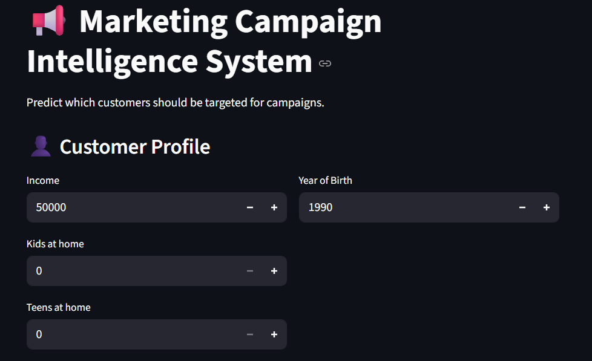
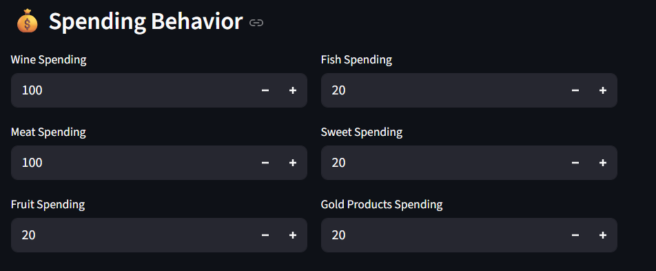
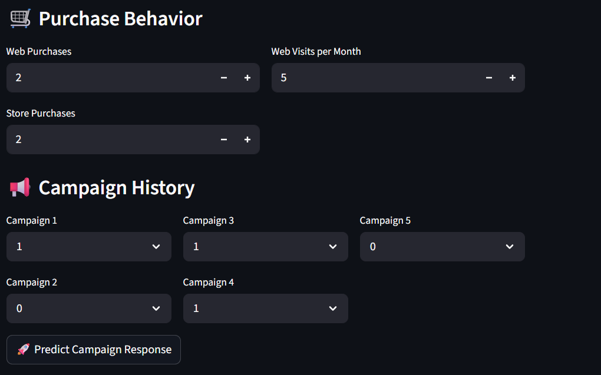
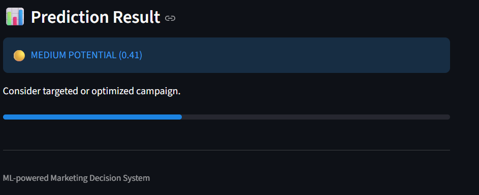

# 📢 Marketing Campaign Intelligence System

## 🚀 Overview

An end-to-end machine learning system that predicts whether a customer is likely to respond to a marketing campaign, enabling smarter targeting and optimized marketing spend.

---

## 🎯 Business Problem

Marketing campaigns are expensive. Targeting the wrong customers leads to low ROI and wasted budget.

This system helps:

* Identify high-probability customers
* Segment users into actionable groups
* Improve campaign efficiency

---

## 🧠 Solution

Built a complete ML pipeline that:

* Processes customer data
* Engineers meaningful behavioral features
* Trains and evaluates multiple models
* Selects the best model based on ROC-AUC
* Deploys predictions via an interactive Streamlit app

---

## 📊 Model Performance

| Model               | Accuracy | ROC-AUC |
| ------------------- | -------- | ------- |
| Logistic Regression | ~0.81    | ~0.81   |
| Random Forest       | ~0.83    | ~0.83   |
| XGBoost             | ~0.82    | ~0.82   |

**Selected Model:** Random Forest (best ROC-AUC)

---

## ⚙️ Features Used

* Customer Profile: Income, Age, Household
* Spending Behavior: Product-wise spending
* Purchase Behavior: Web/store activity
* Campaign History: Previous campaign responses

---

## 🏗️ System Architecture

Data → Preprocessing → Feature Engineering → Model Training → Model Selection → Prediction API → Streamlit App

---

## 📈 Output Interpretation

| Probability | Segment             |
| ----------- | ------------------- |
| > 0.6       | High Value Customer |
| 0.3–0.6     | Medium Potential    |
| < 0.3       | Low Probability     |

---

## 💻 Tech Stack

* Python
* Scikit-learn
* XGBoost
* Pandas / NumPy
* Streamlit

---

## ▶️ How to Run

```bash
pip install -r requirements.txt
python -m src.train
streamlit run app.py
```

---

## 📌 Key Highlights

* End-to-end ML system (not just a notebook)
* Model comparison & selection
* Real-time prediction interface
* Business-focused output

---

## 📷 Demo





---

## 📬 Author

Viswa Musunuri
